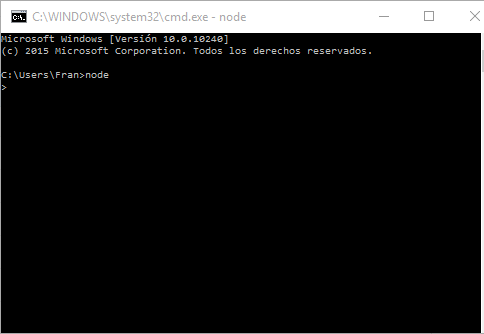
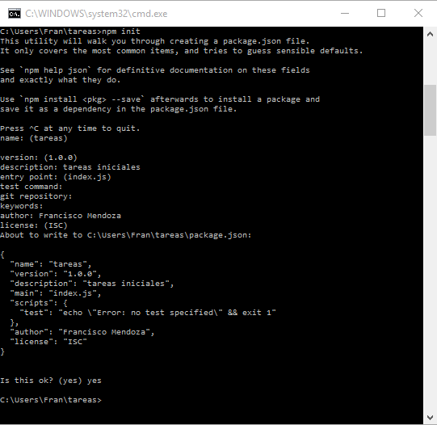
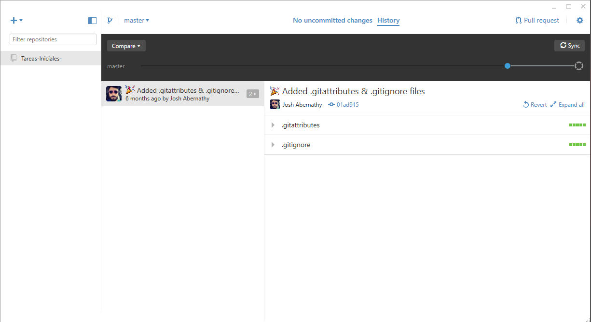
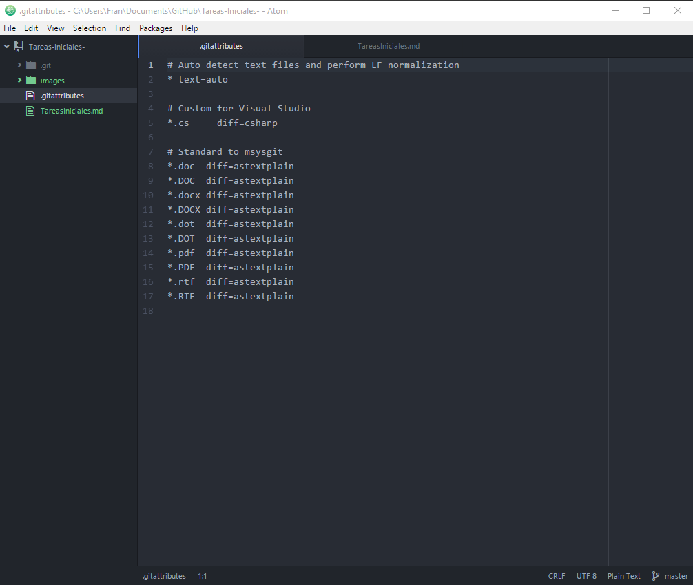
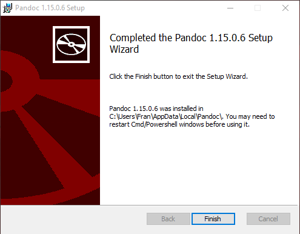

#Sistemas y Tecnologías Web: Tareas iniciales

----

##Introducción

   En esta práctica vamos a explicar la realización de las instalaciones de los programas que se utilizarán a lo largo del curso en la asignatura de Sistemas y Tecnologías Web en el Sistema Operativo Windows. Para ello hemos utilizado el formato markdown y mediante la herramienta pandoc hemos generado el HTML. Para completar esta práctica hemos realizado la instalación de diversar herramientas que usaremos durante el curso como son:

  * node.JS
  * Express
  * Github App para Windows
  * Atom
  * Pandoc

##Instalación de node.JS

1. Descargamos el programa de la siguiente página: [node.JS](http://nodejs.org/)
2. Lo ejecutamos y seguimos las instrucciones de instalación
3. La ejecución se puede realizar a través de la consola con el comando node o bien desde el ejecutable de node.JS

    

##Instalación de express

1. Creamos un directorio.

2. Usamos el comando _npm init_ dentro del directorio para crear package.json en nuestra aplicación.

    

3. Ahora instalamos express mediante el comando _npm install express --save_

    

##Instalación de Github App para Windows

1. Descargamos la APP de Github: [Github App](https://desktop.github.com/)
2. La ejecutamos y realizamos la instalación.

    

##Instalación de Atom

1. Descargamos la aplicación: [Atom](https://atom.io/)
2. La ejecutamos y seguimos la instalación.

    

##Instalación de PANDOC

1. Descargamos el programa de la página: [PANDOC](http://pandoc.org/installing.html)
2. Lo ejecutamos y realizamos instalación.

    

3. Una vez instalado, debemos comprobar que se encuentra en las variables de entorno de Windows.

##Uso de PANDOC

   Para generar el HTML correspondiente a un fichero .md realizamos los siguientes pasos:

1. Abrimos una terminal.

2. Nos situamos en el directorio donde tengamos el fichero .md del que queremos generar el HTML.

3. Ejecutamos el siguiente comando: _pandoc -s -o informe.html TareasIniciales.md._

4. Ahora tenemos en nuestro directorio el archivo HTML, que nos muestra el contenido de TareasIniciales.md en formato HTML.

----

* Ver [repositorio](https://github.com/alu0100600582/TareasIniciales)
